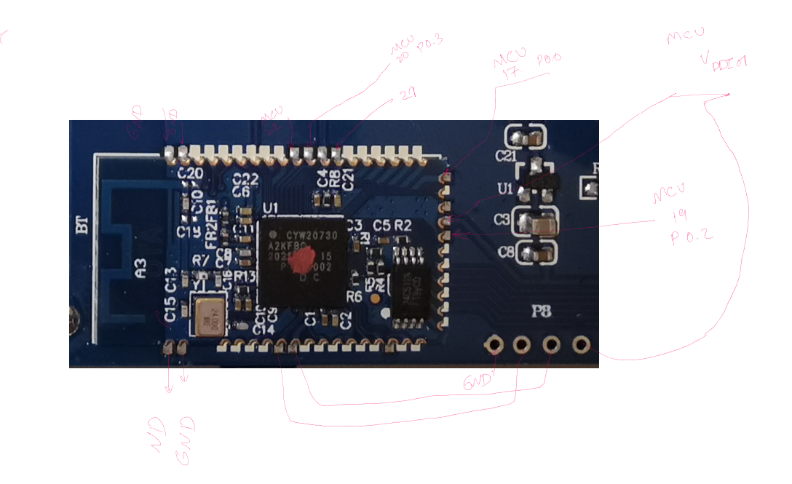

# Blitzwolf BW-KB1 Firmware Reverse Engineering

It is based on the wor on DK63 from smp4488.

VID 0x05AC

PID 0x024F

VID 0C45 is not used for this keyboard therefore for uploading the firmware via USB interface, it is needes to update the VIC and PID to the above.

For default flashing: Bus 001 Device 006: ID 0c45:7044 Microdia.

or                    Bus 001 Device 011: ID 0c45:7040 Microdia

For keyboard: Bus 001 Device 009: ID 05ac:024f Apple, Inc. 

This project is to reverse engineer the Kmove / DIERYA DK63 to get QMK running on it.
Use this information at your own risk. I'm not liable if you break something.

## Keyboard

* [Vendor Page](https://www.blitzwolf.com/63-Key-Mechanical-Keyboard-p-519.html)
* [Firmware Download](https://www.blitzwolf.com/bg_os/other/upload_temp/drivers/20200921/5f6955b77295dBlitzwolf%20KB1%20V1.01%20patch.exe)
* [User Manual](https://www.blitzwolf.com/bg_os/other/upload_temp/drivers/20200620/5eedb50508d51BW-KB1%20user%20manual.pdf)
* [Reddit Post](https://www.reddit.com/r/embedded/comments/e4iriu/keyboard_mcu_help/)
* [BlitzWolf KB1 Downloads](https://www.blitzwolf.com/bg_os/other/upload_temp/drivers/20200921/5f69559ec19a6BlitzWolf%20KB1%20V1.01n%20drive.exe)
* [BlitzWolf Suppourt](https://www.blitzwolf.com/support.html)

## Tasks

- [x] Identify MCU `VS11K09A-1` / `Sonix SN32F248BF`
- [x] Find data sheet [VS11K09A-1](http://evision.net.cn/include/upload/kind/file/20190413/20190413174647_5965.pdf) / [Sonix SN32F248B](http://www.sonix.com.tw/files/1/9BB2674D32FB0D70E050007F01007532)
- [x] Find SDK and dev tools
- [x] Get SWD working
- [x] Ability to flash firmware
- [x] Get origional firmware
- [x] Enable SWD in current firmware
- [x] Port Chibios to `Sonix SN32F248BF` [porting guide](http://wiki.chibios.org/dokuwiki/doku.php?id=chibios:guides:port_guide)
    - [ ] ~Get compiler to work with `SN32F248BF` Keil packs~
    - [x] USB LLD
    - [x] GPIO LLD
    - [ ] ~UART LLD~
    - [x] Timers LLD
    - [ ] SPI LLD
    - [ ] ~I2C LLD~
- [x] Get QMK firmware working
    - [x] Basic keyboard functionality [Build Tools](https://docs.qmk.fm/#/getting_started_build_tools)
    - [x] RGB Leds and animations `VSPW01` [RGB Matrix](https://docs.qmk.fm/#/feature_rgb_matrix)
    - [ ] Bluetooth `PAR2801QN-GHVC` [docs](https://docs.qmk.fm/#/feature_bluetooth)
- [x] Dump origional bootloader

## Flashing

- Download this flashing software for windows: 
[SONiX_USB_MCU_ISP_Tool_V2.3.1.7-.zip](https://github.com/qmk/qmk_firmware/files/5862715/SONiX_USB_MCU_ISP_Tool_V2.3.1.7-.zip)

- Put your keyboard in boot/recovery/flash mode via connecting boot pin to ground before connecting the keyboard via USB.

- Then flash the binary via the software after setting the following configuration: 

## Chips

* Main MCU - EVision [VS11K09A-1](http://evision.net.cn/include/upload/kind/file/20190413/20190413174647_5965.pdf), Seems to be based on the [Sonix SN32F248BF](http://www.sonix.com.tw/files/1/9BB2674D32FB0D70E050007F01007532)
* Bluetooth - ~!TON~ PXI Pixart PAR2801QN-GHVC
    * [FCC Doc](https://fccid.io/2AIPB-PAJ2801UA-40/User-Manual/Users-Manual-3083972) 
    * [PAR2801QN-GHVC](https://en.sziton.com/wp-content/uploads/datasheets/module/PAR2801-Q32P-datasheet-v1.2.pdf)
* ~LED driver~ Charging Chip - EVision [VSPW01](http://www.evision.net.cn/include/upload/kind/file/20190413/20190413175237_5340.pdf)

| Name      | Start    | End      | Length  | R    | W    | X     | Volatile | Overlay | Type    | Initialized | Byte Source                  | Source        | Comment                  |
|-----------|----------|----------|---------|------|------|-------|----------|---------|---------|-------------|------------------------------|---------------|--------------------------|
| ram       | 00000000 | 0000ffff | 0x10000 | true | true | true  | false    | false   | Default | true        | File: blitzwolf-kb1.bin: 0x0 | Binary Loader |                          |
| Boot-ROM  | 1fff0000 | 1fff0bff | 0xc00   | true | true | false | false    | false   | Default | false       |                              |               |                          |
| SRAM      | 20000000 | 20001fff | 0x2000  | true | true | false | false    | false   | Default | false       |                              |               |                          |
| SN_CT16B0 | 40000000 | 40001fff | 0x2000  | true | true | false | true     | false   | Default | false       |                              |               | Generated by SVD-Loader. |
| SN_CT16B1 | 40002000 | 40003fff | 0x2000  | true | true | false | true     | false   | Default | false       |                              |               |                          |
| SN_WDT    | 40010000 | 40011fff | 0x2000  | true | true | false | true     | false   | Default | false       |                              |               | Generated by SVD-Loader. |
| SN_UART2  | 40012000 | 40013fff | 0x2000  | true | true | false | true     | false   | Default | false       |                              |               |                          |
| SN_UART1  | 40014000 | 40015fff | 0x2000  | true | true | false | true     | false   | Default | false       |                              |               |                          |
| SN_UART0  | 40016000 | 40017fff | 0x2000  | true | true | false | true     | false   | Default | false       |                              |               |                          |
| SN_I2C0   | 40018000 | 40019fff | 0x2000  | true | true | false | true     | false   | Default | false       |                              |               |                          |
| SN_SPI0   | 4001c000 | 4001dfff | 0x2000  | true | true | false | true     | false   | Default | false       |                              |               | Generated by SVD-Loader. |
| SN_ADC    | 40026000 | 40027fff | 0x2000  | true | true | false | true     | false   | Default | false       |                              |               | Generated by SVD-Loader. |
| SN_PMU    | 40032000 | 40033fff | 0x2000  | true | true | false | true     | false   | Default | false       |                              |               | Generated by SVD-Loader. |
| SN_PFPA   | 40042000 | 40043fff | 0x2000  | true | true | false | true     | false   | Default | false       |                              |               | Generated by SVD-Loader. |
| SN_GPIO0  | 40044000 | 40045fff | 0x2000  | true | true | false | true     | false   | Default | false       |                              |               |                          |
| SN_GPIO1  | 40046000 | 40047fff | 0x2000  | true | true | false | true     | false   | Default | false       |                              |               |                          |
| SN_GPIO2  | 40048000 | 40049fff | 0x2000  | true | true | false | true     | false   | Default | false       |                              |               |                          |
| SN_GPIO3  | 4004a000 | 4004bfff | 0x2000  | true | true | false | true     | false   | Default | false       |                              |               |                          |
| SN_USB    | 4005c000 | 4005dfff | 0x2000  | true | true | false | true     | false   | Default | false       |                              |               | Generated by SVD-Loader. |
| SN_SYS1   | 4005e000 | 4005ffff | 0x2000  | true | true | false | true     | false   | Default | false       |                              |               |                          |
| SN_SYS0   | 40060000 | 40061fff | 0x2000  | true | true | false | true     | false   | Default | false       |                              |               |                          |
| SN_FMC    | 40062000 | 40063fff | 0x2000  | true | true | false | true     | false   | Default | false       |                              |               |                          |

## Evision VS11K09A-1 Debug Recovery Mode / SWD

1. Hookup SWCLK, SWDIO, and Ground using the testpoints outlined below
    
    * Note: These pins are being use by the MCU to control functionality. Im tyring to enable SWD in the default firmware to debug without Debug Recovery Mode.
2. Hookup the other ends of the wires to your debugger. I used a Raspberry PI 3 and the ST-Link V2.
3. Using the ground point hold the boot pin to ground while turning on the power.

## Key Matrix & MCU

[Keyboard Layout www.keyboard-layout-editor.com](http://www.keyboard-layout-editor.com/##@_name=BlitzWolf%C2%AEBW-KB1%20Bluetooth%20V5.0%20RGB%2063%20Key%20Mechanical%20Keyboard&author=Islam%20Mansour&switchMount=cherry&switchBrand=gateron&switchType=KS-3-Tea&pcb:true%3B&@=Esc&=!%0A1&=%2F@%0A2&=%23%0A3&=$%0A4&=%25%0A5&=%5E%0A6&=%2F&%0A7&=*%0A8&=(%0A9&=)%0A0&=%2F_%0A-&=+%0A%2F=&_w:2%3B&=Backspace%3B&@_w:1.5%3B&=Tab&=Q&=W&=E&=R&=T&=Y&=U&=I&=O&=P&=%7B%0A%5B&=%7D%0A%5D&_w:1.5%3B&=%7C%0A%5C%3B&@_w:1.75%3B&=Caps%20Lock&=A&=S&=D&=F&=G&=H&=J&=K&=L&=%2F:%0A%2F%3B&=%22%0A'&_w:2.25%3B&=Enter%3B&@_w:2.25%3B&=Shift&=Z&=X&=C&=V&=B&=N&=M&=%3C%0A,&=%3E%0A.&_w:1.75%3B&=Shift&=%E2%86%91&=%3F%0A%2F%2F%3B&@_w:1.25%3B&=Ctrl&_w:1.25%3B&=Win&_w:1.25%3B&=Alt&_a:7&w:6.25%3B&=&_a:4%3B&=Alt&=Fn&=%E2%86%90&=%E2%86%93&=%E2%86%92)

## LEDs

They seem to be driven by GPIO and transistors.
- [ ] Figure out pin map and matrix
- [ ] Caps lock LED

## Bluetooth

Appears to be an another ARM Cortex M0 MCU with UART and GPIO.
- [ ] SWD debugging
- [ ] Pin map to main MCU

## Extract default dk63 firmware.hex
1. Download [Resource Hacker](http://www.angusj.com/resourcehacker/) (Not sure of a mac or linux variant)
2. Download [Firmware Update tool](https://kmovetech.com/DIERYA%20&%20Kemove%20Wired%20mode%20firmware%20update.rar)
3. Extract the firmware .rar and open the .exe in RH
4. Look for `RCData 4000:0`, this is the hex file of the firmware
5. Right click on `4000:0` and choose `Save Resource to BIN file`
6. Save the firmware so it can be examined or uplodaded.

## Firmware Flash
1. Download the USB MCU ISP [tool](http://www.sonix.com.tw/files/1/8226BAA772296B66E050007F010014EB)
2. Open the program and click load file.
3. Select `SN32F4xB` and then the firmware file.
4. The VID should alread be `0C45` and enter `766B` for the PID.
5. Click Start
6. Profit!

## ST-Link V2
* I was not able to get this to work with the st-link software on windows.
* I did manage to get it to work with openocd using [this config](https://github.com/smp4488/dk63/blob/master/stlink.cfg)
* Working on the `SN32F24X` config [here](https://github.com/smp4488/dk63/blob/master/vs11k09a-1.cfg)

## Firmware Dump
* [Coretex M0 Exploit](https://blog.includesecurity.com/2015/11/NordicSemi-ARM-SoC-Firmware-dumping-technique.html?m=1&utm_source=share&utm_medium=ios_app&utm_name=iossmf)
* [Keil ROM Self-Test Checksum](http://www.keil.com/appnotes/files/an277.pdf)

## GDB Recovery Mode
1. set $pc=0x1FFF0301
2. cont

## Docker
* [Docker Machine on OS X](http://gw.tnode.com/docker/docker-machine-with-usb-support-on-windows-macos/)

## Tools

* [Ghidra](https://ghidra-sre.org/)
* [SVD-Loader](https://leveldown.de/blog/svd-loader/) for Ghidra automates the entire generation of peripheral structs and memory maps for over 650 different microcontrollers
* [Binary Ninja](https://binary.ninja/)
* [Cutter](https://cutter.re/)
* [radare2](https://github.com/radareorg/radare2)
    * [Disassembling arm binary using radare2](https://gist.github.com/JamesHagerman/8d7bfac873fa6b0109b2e68f58d34f35)
* [Wireshark USB caprture](https://wiki.wireshark.org/CaptureSetup/USB)
* [Firmware patch framework nexmon](https://github.com/seemoo-lab/nexmon)
* [ARM Assembly Tutorial](https://azeria-labs.com/writing-arm-assembly-part-1/)

## Links

Firmware Updater Executable Analysis
https://www.hybrid-analysis.com/sample/21cf79c4f5982e0d73e8269c03a043f16898292920074491d5452eea5155e1eb?environmentId=100

VS11K09A-1 VS 32-Bit Cortex-M0 Micro-Controller
http://evision.net.cn/include/upload/kind/file/20190413/20190413174647_5965.pdf

DEF CON 26 IoT VILLAGE - Dennis Giese - How to modify ARM Cortex M based firmware A step by step app
https://www.youtube.com/watch?v=Qvxa6o2oNS0

BalCCon2k16 - Travis Goodspeed - Nifty Tricks for ARM Firmware Reverse Engineering
https://www.youtube.com/watch?v=GX8-K4TssjY

Getting STLink V2 Serial Number
https://armprojects.wordpress.com/2016/08/21/debugging-multiple-stm32-in-eclipse-with-st-link-v2-and-openocd/

SUE 2017 - Reverse Engineering Embedded ARM Devices - by pancake
https://www.youtube.com/watch?v=oXSx0Qo2Upk

Analyzing Keyboard Firmware
https://mrexodia.github.io/reversing/2019/09/28/Analyzing-keyboard-firmware-part-1
https://mrexodia.github.io/reversing/2019/09/28/Analyzing-keyboard-firmware-part-2
https://mrexodia.github.io/reversing/2019/09/28/Analyzing-keyboard-firmware-part-3

Hacking the fx-CP400
https://the6p4c.github.io/2018/01/15/hacking-the-gc-part-1.html

Raspberry PI OpenOCD SWD / JTAG
https://iosoft.blog/2019/01/28/raspberry-pi-openocd/

OpenOcd Creating Flash Drivers
https://github.com/doctek/COOCDFlash/wiki/Creating-and-using-flash-drivers

Stack Exchange ARM Firmware Reverse Engineering Walkthrough
https://reverseengineering.stackexchange.com/questions/15311/running-a-binary-identified-as-an-arm-excutable-by-binwalk-disasm/15317
https://reverseengineering.stackexchange.com/questions/15006/approach-to-extract-useful-information-from-binary-file

QMK Nuvoton Port PR
[https://github.com/qmk/ChibiOS-Contrib/pull/10]

* https://docs.qmk.fm/
* https://github.com/qmk/qmk_firmware/blob/ee700b2e831067bdb7584425569b61bc6329247b/tmk_core/protocol/chibios/README.md
* http://wiki.chibios.org/dokuwiki/doku.php?id=chibios:guides:port_guide
* https://github.com/ChibiOS/ChibiOS/tree/14f274991fc85b70dd4294c482f6d4ce79e72339/os/hal/boards/OLIMEX_MSP430_P1611
* http://www.sonix.com.tw/article-en-998-21393
* https://ydiaeresis.wordpress.com/2018/04/23/i-dont-steal-bikes-part-2/
* https://interrupt.memfault.com/blog/cortex-m-fault-debug#registers-prior-to-exception
* https://github.com/bnahill/PyCortexMDebug
* http://zuendmasse.de/blog/2018/01/21/gdb-+-svd/
* https://mcuoneclipse.com/2018/01/27/converting-a-raw-binary-file-into-an-elf-dwarf-file-for-loading-and-debugging/
* https://mcuoneclipse.com/2019/05/26/reverse-engineering-of-a-not-so-secure-iot-device/
